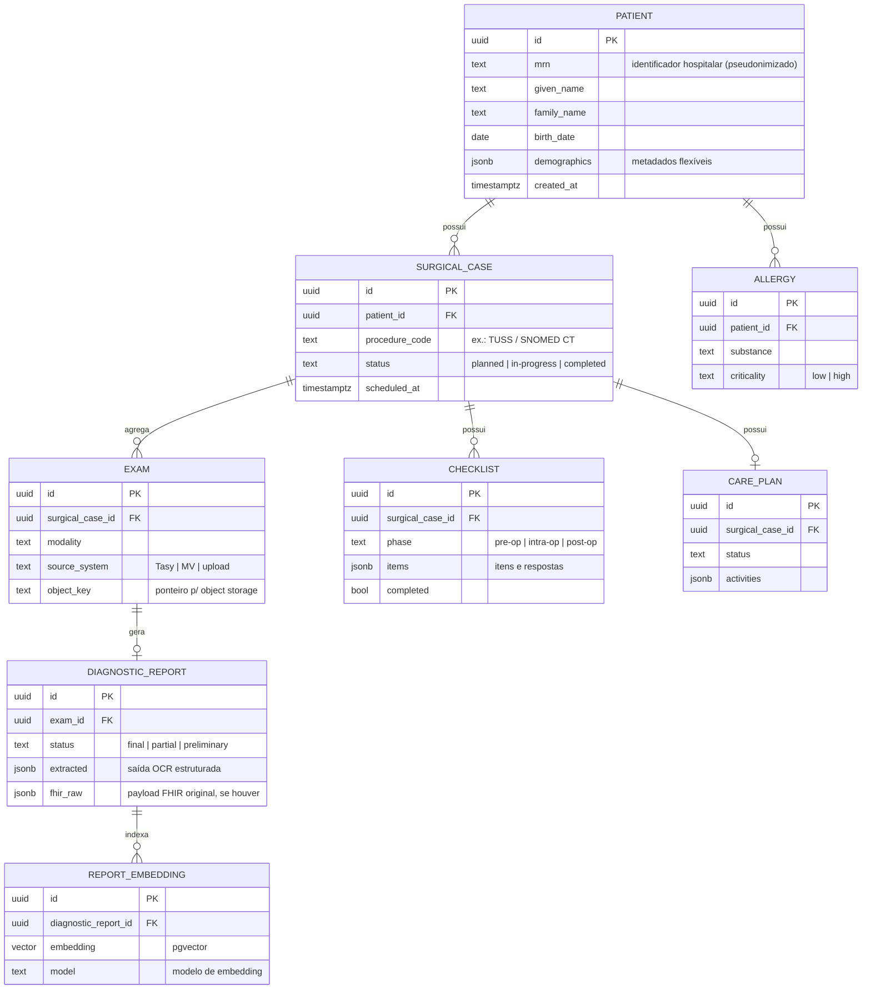

# Modelo de dados

O HubSurg adota um **esquema híbrido** no PostgreSQL: tabelas normalizadas para dados
transacionais e relacionais (pacientes, exames, agendamentos, checklists) e colunas
**JSONB** para metadados flexíveis e payloads semiestruturados (ex.: laudo extraído por OCR).
Busca semântica usa a extensão **pgvector**.

Decisão registrada em [ADR-0003](adr/0003-postgresql-pgvector.md).

## Princípios

- **Normalizado por padrão, JSONB por exceção.** Campos consultados/filtrados com frequência
  e sujeitos a integridade referencial são colunas tipadas. Estruturas variáveis ou de
  fornecedor (saída de OCR, payload FHIR bruto) ficam em JSONB.
- **O canônico interno é mapeável para FHIR.** O modelo não é o FHIR, mas cada entidade tem
  correspondência clara — ver [mapeamento FHIR](../fhir/resource-mapping.md).
- **Minimização.** Só persistimos o necessário à função (ver
  [privacidade](../security/privacy-and-security.md)).

## Diagrama entidade-relacionamento (alvo do MVP)

## Estratégia de índices

| Caso de uso | Tipo de índice | Exemplo |
|-------------|----------------|---------|
| Lookups e joins relacionais | **B-Tree** | `patient(mrn)`, `surgical_case(patient_id)` |
| Filtro por status / data | **B-Tree** | `surgical_case(status, scheduled_at)` |
| Consulta em chaves JSONB | **GIN** | `diagnostic_report USING gin (extracted jsonb_path_ops)` |
| Busca semântica de laudos | **GiST / HNSW (pgvector)** | `report_embedding USING hnsw (embedding vector_cosine_ops)` |

> Nota: a extensão `vector` oferece índices `ivfflat` e `hnsw`. HNSW é o padrão recomendado
> para recall alto; `ivfflat` é alternativa quando o custo de construção do índice importa.
> A descrição original menciona GiST — a escolha final depende da versão do pgvector adotada.

## Notas de evolução

- **Particionamento:** `surgical_case` e `diagnostic_report` são candidatos a particionamento
  por intervalo de data quando o volume justificar.
- **Auditoria:** tabelas sensíveis terão *append-only audit log* (gatilho ou CDC), alinhado à
  exigência de logs protegidos contra gravação não autorizada.
- **Criptografia em repouso:** transparente via KMS no nível de volume/instância; campos de
  altíssima sensibilidade podem receber criptografia em nível de aplicação adicional.
