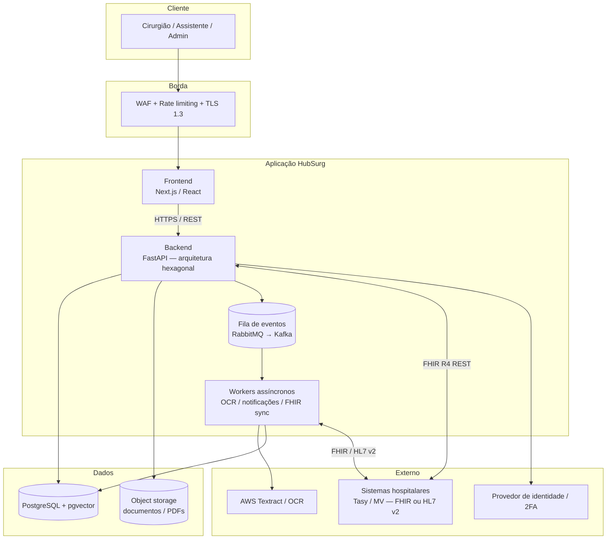
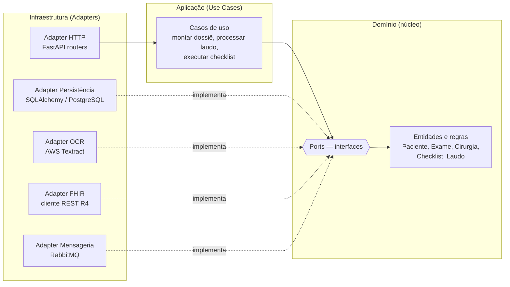

# Visão geral da arquitetura

O HubSurg é uma plataforma web modular, organizada para suportar escala, acoplamento
controlado a sistemas hospitalares legados e conformidade regulatória desde o início.

## Diagrama de contêineres (C4 nível 2)

## Frontend

- **Tecnologia:** Next.js (React) com TypeScript.
- **Design de UI:** Atomic Design — componentes modulares e reutilizáveis (átomos →
  moléculas → organismos → páginas).
- **Estratégia de renderização** (ver [ADR-0005](adr/0005-estrategia-renderizacao-frontend.md)):
  - **SSR** para checklists e relatórios críticos — conteúdo sensível ao contexto, indexável
    e consistente no primeiro paint.
  - **CSR** para conteúdo assíncrono e interações que não bloqueiam o carregamento inicial.
- **Integração:** consome as APIs do backend exclusivamente via **HTTPS com TLS 1.3**.

## Backend — arquitetura hexagonal (Ports & Adapters)

Decisão registrada em [ADR-0002](adr/0002-arquitetura-hexagonal-backend.md). O domínio
clínico não conhece frameworks, banco ou fornecedores; estes entram por **adaptadores**.

### Camadas

| Camada | Responsabilidade | Depende de |
|--------|------------------|------------|
| **Domínio** | Entidades clínicas, invariantes e regras (ex.: validação de checklist pré/pós-operatório). Define *ports* (interfaces). | Nada externo |
| **Aplicação** | Orquestra casos de uso, transações e chamadas a *ports*. | Domínio |
| **Infraestrutura** | Implementa *ports* como *adapters*: HTTP (FastAPI), persistência, OCR, FHIR, mensageria. | Aplicação + Domínio |

> **Regra de dependência:** as setas apontam sempre para dentro. A infraestrutura depende do
> domínio, nunca o contrário. Isso permite trocar PostgreSQL, OCR ou cliente FHIR sem tocar
> nas regras clínicas.

### Orquestração de eventos

Operações longas ou de efeito colateral externo (OCR de laudos, notificações, sincronização
FHIR) são publicadas como **eventos** e processadas por *workers* assíncronos. MVP usa
**RabbitMQ**; a interface de mensageria é um *port*, então a migração futura para **Kafka**
(maior throughput, retenção/replay) não afeta o domínio.

## Princípios de engenharia

- **SOLID** — componentes orientados a serviço com responsabilidade única; dependências por
  abstração (os *ports* da hexagonal são a aplicação direta do Princípio de Inversão de
  Dependência).
- **Repository layer** — acesso a dados sempre mediado por repositórios que encapsulam as
  regras de consistência; o domínio nunca emite SQL diretamente.
- **Infraestrutura como código (IaC)** — provisionamento com Terraform; ambientes
  reproduzíveis.
- **CI/CD** — GitHub Actions: lint → testes unitários (PyTest, React Testing Library) →
  testes de integração de contratos de API (Newman/Postman) → deploy segregado
  **Dev → Staging → Produção**.

## Mapa de portas e adaptadores (resumo)

| Port (interface de domínio) | Adapter (infra) | Substituível por |
|-----------------------------|-----------------|------------------|
| `PatientRepository` | SQLAlchemy + PostgreSQL | Outro RDBMS |
| `DocumentOcrService` | AWS Textract | Google Document AI, Tesseract |
| `FhirGateway` | Cliente FHIR R4 REST | Servidor FHIR interno (HAPI) |
| `EventBus` | RabbitMQ | Kafka |
| `ObjectStore` | S3 | MinIO / GCS |

## Próximos passos de implementação

1. Materializar o esqueleto do backend seguindo as três camadas.
2. Definir o schema inicial conforme [modelo de dados](data-model.md).
3. Implementar o `FhirGateway` e os mapeadores descritos em [mapeamento FHIR](../fhir/resource-mapping.md).
4. Configurar o pipeline de CI/CD e a base de IaC.
