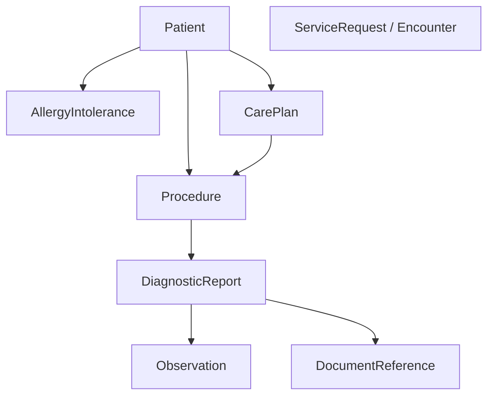
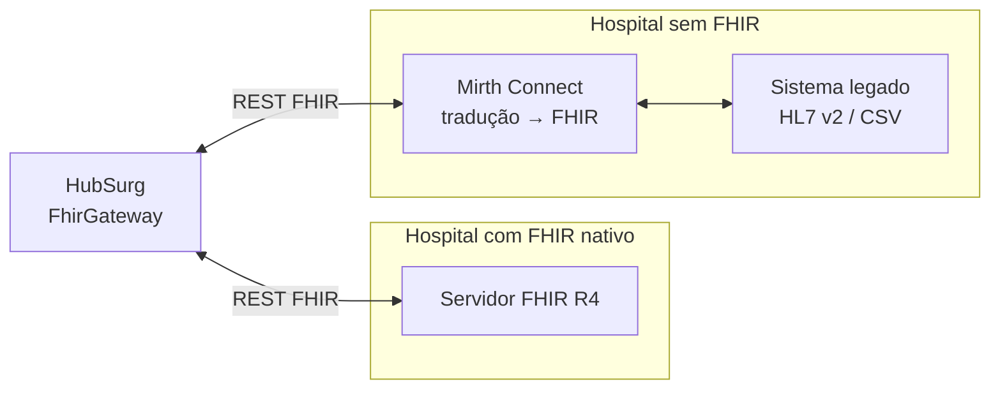

# Mapeamento de recursos HL7 FHIR

A **interoperabilidade by design** do HubSurg parte de um princípio: o modelo canônico interno
(ver [modelo de dados](../architecture/data-model.md)) é **mapeável para recursos FHIR R4**.
O FHIR não é o modelo de persistência — é o **contrato de troca** com sistemas hospitalares.

Decisão registrada em [ADR-0004](../architecture/adr/0004-fhir-camada-interoperabilidade.md).

## Por que FHIR

- **Estrutura hierárquica e padronizada** — cada elemento do dossiê (paciente, exame, laudo,
  cirurgia, plano de cuidado) corresponde a um *recurso*.
- **RESTful** — troca de informação natural em arquiteturas modernas baseadas em API.
- **Adoção ampla** — reduz o custo de integração com EHRs/HIS já existentes.

## Como o Dossiê Cirúrgico se decompõe em recursos



## Tabela de mapeamento (entidade interna → recurso FHIR)

| Entidade HubSurg | Recurso FHIR | Campos-chave | Observações |
|------------------|--------------|--------------|-------------|
| `patient` | **Patient** | `identifier` (MRN), `name`, `birthDate` | MRN como `identifier` com `system` do hospital |
| `allergy` | **AllergyIntolerance** | `patient`, `code`, `criticality` | |
| `care_plan` | **CarePlan** | `subject`, `status`, `activity` | Histórico e planos de cuidado |
| `surgical_case` | **Procedure** (+ **Encounter**) | `subject`, `code`, `status`, `performedDateTime` | `code` em SNOMED CT / TUSS |
| `exam` | **ServiceRequest** / **DocumentReference** | `subject`, `code` | Documento bruto vai como `DocumentReference` |
| `diagnostic_report` | **DiagnosticReport** | `status`, `subject`, `result`, `presentedForm` | `status: final \| partial \| preliminary` |
| (achados estruturados do laudo) | **Observation** | `code`, `value[x]` | Referenciados em `DiagnosticReport.result` |

### Exemplo — `DiagnosticReport` a partir do OCR

A saída do OCR (AWS Textract) é estruturada e materializada como `DiagnosticReport`. O `status`
reflete a confiança/completude da extração:

```json
{
  "resourceType": "DiagnosticReport",
  "status": "partial",
  "subject": { "reference": "Patient/123" },
  "code": {
    "coding": [{ "system": "http://loinc.org", "code": "11502-2", "display": "Laboratory report" }]
  },
  "presentedForm": [
    { "contentType": "application/pdf", "url": "https://storage/.../output.pdf" }
  ],
  "result": [{ "reference": "Observation/abc" }]
}
```

> `status: partial` sinaliza extração incompleta/sob revisão; `status: final` só após
> validação. Isso evita que dados não confiáveis sejam tratados como definitivos.

## Estratégias de interoperabilidade



### Caso 1 — hospital com FHIR pronto

Conexão direta via REST. Exemplo de consulta de laudos de um paciente:

```http
GET /fhir/DiagnosticReport?subject=Patient/123&status=final
Accept: application/fhir+json
```

### Caso 2 — hospital sem FHIR

Camada intermediária (ex.: **Mirth Connect**) traduz **HL7 v2** ou exports legados (CSV) para
**FHIR R4**, de modo que o HubSurg sempre fale um único protocolo. O `FhirGateway` permanece
agnóstico à origem.

## Princípios de implementação

- **Anticorrupção:** o `FhirGateway` (um *port* do domínio) traduz FHIR ↔ modelo canônico
  interno; o domínio nunca manipula JSON FHIR cru.
- **Tolerância a perfis:** validar contra perfis FHIR aplicáveis quando disponíveis; degradar
  graciosamente para o core R4.
- **Idempotência:** sincronizações usam `identifier` lógico para evitar duplicação de recursos.
