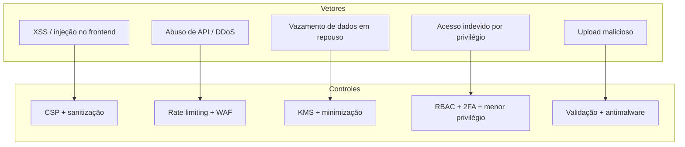

# Privacidade e cibersegurança

O HubSurg processa **dados pessoais sensíveis de saúde**. O design adota *privacy by design*
e *by default*, com conformidade à **LGPD**, ao **GDPR** (quando aplicável) e às resoluções do
**CFM** sobre prontuário e telessaúde.

## 1. Privacidade e conformidade jurídica (LGPD / GDPR / CFM)

| Princípio | Aplicação no HubSurg |
|-----------|----------------------|
| **Minimização de dados** | Persistir apenas o indispensável à função (ver [modelo de dados](../architecture/data-model.md)). |
| **Base legal** | Tratamento de documentos enviados por upload requer **consentimento expresso** do paciente; tutela da saúde como base legal complementar quando cabível (LGPD art. 11). |
| **Finalidade e transparência** | Cada categoria de dado tem finalidade declarada; titular pode exercer direitos (acesso, correção, eliminação). |
| **Anonimização / pseudonimização** | Dados usados para treino de OCR/modelos são **anonimizados**; identificadores diretos são pseudonimizados (separação de chave). |
| **Retenção** | Prazos de guarda alinhados ao CFM (prontuário) com expurgo/anonimização ao fim do ciclo. |

> **Atenção criptográfica:** `bcrypt`/`SHA-256` servem para **hashing** (senhas, tokens,
> de-identificação irreversível) — **não** são cifragem reversível. Para proteção de dados que
> precisam ser recuperados, usar **criptografia** (KMS / AES-GCM), não hashing. Os dois
> conceitos não são intercambiáveis.

## 2. Cibersegurança

### Armazenamento seguro
- **Criptografia em repouso** no PostgreSQL e no object storage via **KMS** (AWS KMS ou
  equivalente), no nível de volume/instância.
- Campos de altíssima sensibilidade podem receber **criptografia adicional em nível de
  aplicação** (envelope encryption).

### Autenticação e controle de acesso
- **2FA** obrigatório para cirurgiões (e demais perfis com acesso a dados clínicos).
- **JWT** para autenticação de sessão de API (tokens curtos + *refresh* rotativo).
- **RBAC** — papéis distintos com menor privilégio:

| Papel | Permissões (resumo) |
|-------|---------------------|
| Cirurgião | Leitura/escrita do dossiê dos seus casos; conclusão de checklists |
| Assistente | Leitura e preenchimento operacional; sem ações clínicas finais |
| Administrador | Gestão de usuários e configuração; **sem** acesso clínico por padrão |

> Princípio: separação de deveres. Administração da ferramenta ≠ acesso a dados clínicos.

### Gestão de logs e auditoria
- Logs centralizados (ELK Stack ou CloudWatch), **protegidos contra gravação não autorizada**
  (append-only / WORM).
- Trilha de auditoria de acesso a dados sensíveis (quem, quando, qual registro).

## 3. Comunicação e integração segura

- **TLS 1.3 obrigatório** em todo tráfego (cliente↔API e API↔sistemas hospitalares).
- **CSP (Content Security Policy)** para mitigar XSS no frontend.
- **Rate limiting** (Nginx ou middleware FastAPI) contra abuso de API e DDoS de aplicação.
- **CSRF tokens** em fluxos baseados em formulário/sessão.
- **Validação e saneamento** de toda entrada — especialmente uploads (tipo, tamanho,
  varredura antimalware) antes do processamento por OCR.

## 4. Modelo de ameaças (resumo)

## Estado de implementação no backend

A camada de segurança do backend (ver [ADR-0006](../architecture/adr/0006-camada-de-seguranca.md))
implementa, com a stdlib e atrás de ports trocáveis:

- **Autenticação JWT (HS256)** via `POST /auth/token`.
- **RBAC** (`surgeon`/`assistant`/`admin`) aplicado nos endpoints.
- **Hashing de senha** com PBKDF2-HMAC-SHA256.
- **Rate limiting** e **cabeçalhos** CSP/HSTS/X-Frame-Options/nosniff.

Pendentes (plano): 2FA, CSRF, criptografia em repouso (KMS), logs imutáveis/auditoria,
IdP/diretório de usuários, e a migração para RS256 + bcrypt/argon2 em produção.

## Checklist de conformidade para o MVP

- [ ] Mapa de dados pessoais e suas bases legais (RoPA / inventário LGPD).
- [ ] Fluxo de consentimento no upload de documentos.
- [ ] Criptografia em repouso habilitada (KMS) e TLS 1.3 forçado.
- [~] RBAC implementado e testado; **2FA** pendente.
- [ ] Logs centralizados, imutáveis e com trilha de auditoria.
- [~] CSP e rate limiting configurados; **CSRF** pendente.
- [ ] Processo de pseudonimização para dados de treino de modelos.
